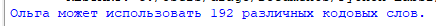
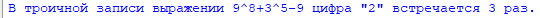
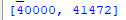

# Python-Labs2

# Лабораторная работа №2 (Вариант №2)

## Задание 1 (00_code_words.py)
    Подсчет количества кодовых слов для Ольги.
Программа подсчитывает количество кодовых слов состоящих из 4 букв используя модуль itertools, где первой буквой могут быть только X, Y или Z, а остальные A, B, C или D.

**Скриншот результата:**  

---

## Задание 2 (01_count_digit_2_in_ternary.py)
    Вычисление количества цифр «2» в троичной записи выражения 9^8 + 3^5 – 9.
Программа вычисляет количество цифр "2" встречающихся в выражении 9^8 + 3^5 – 9 представленного в троичной системе счисления.

**Скриншот результата:**  

---

## Задание 3 (02_find_numbers_with_five_odd_divisors.py)
    Поиск чисел с ровно пятью нечётными делителями на отрезке [40000; 50000].
Программа перебирает все числа в диапазоне от 40000 по 50000 и для каждого числа находит все нечётные делители, проверяет на количество нечетных делителей равное 5 с последующим выводом подходящих чисел в порядке возрастания. 

**Скриншот результата:**  

---

## Ссылки на используемые материалы

1. **Itertools в Python** — https://habr.com/ru/companies/otus/articles/529356
2. **Функция делителей** — https://ru.wikipedia.org/wiki
3. **Официальная документация Python** —  https://docs.python.org/3/